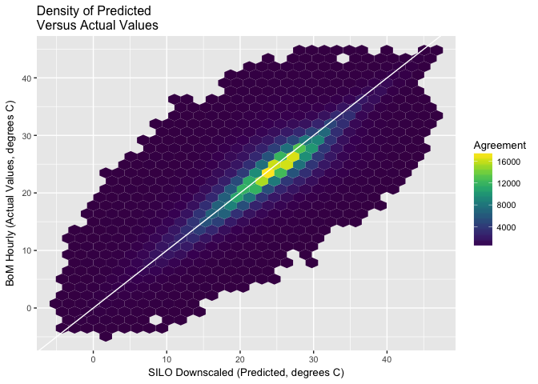

<!-- README.md is generated from README.Rmd. Please edit that file -->
[](https://travis-ci.org/ToowoombaTrio/WINS) [](https://ci.appveyor.com/project/adamhsparks/WINS/branch/master) [](https://codecov.io/github/NA/NA?branch=master)

WINS - crop stress *W*eather *IN*formation delivery *S*ystem
============================================================

About
-----

WINS is an R-package constructed as a part of GovHack 2016.

The *WINS* project (formerly called [*John\_Conner*](https://github.com/ToowoombaTrio/John_Conner)) was initiated by the Toowoomba Trio to tackle a major and growing problem faced by Queensland vegetable growers. This challenge is identifying and responding to heat stress in their crops. High temperatures can cause considerable stress to crops, reducing yields and the quality of the produce grown. However, if the stress is identified early enough remedial action can be taken to minimise the damage and save the crop. *WINS* provides a timely warning system for farmers when a heat stress event has likely occurred. The *WINS* project is built in the R environment, an open source statistical programing environment and utilises Australia Bureau of Meteorology (BOM) weather data.

Please watch our [YouTube video](https://m.youtube.com/watch?v=yECTDHx794E%20https://github.com/ToowoombaTrio/John_Conner) describing the *John\_Conner* project for more on how *WINS* was created and works.



Quick Start
===========

This package is only available from GitHub, it is easy to use *devtools* to install it.

``` r
if (!require("devtools")) {
  install.packages("devtools", repos = "http://cran.rstudio.com/") 
  library("devtools")
}

devtools::install_github("ToowoombaTrio/WINS")
library("WINS")
```

Meta
====

If you find bugs or other issues, please report them to us using <https://github.com/ToowoombaTrio/WINS/issues>.

Please note that this project is released with a [Contributor Code of Conduct](CONDUCT.md). By participating in this project you agree to abide by its terms.
