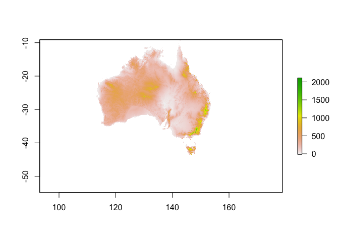

CGIAR SRTM 250m Digital Elevation Model
================

Hole-filled Shuttle Radar Topography Mission (SRTM) data
--------------------------------------------------------

Hole-filled seamless SRTM data V4 aggregated to 250m (SRTM\_SE\_250m) were downloaded using the *raster* packages `getData()` function.

Hole-filled Shuttle Radar Topography Mission (SRTM) data
--------------------------------------------------------

Hole-filled seamless SRTM data V4 aggregated to 250m (SRTM\_SE\_250m) were downloaded using the *raster* packages `getData()` function.

``` r
Oz_dem <- raster::getData(name = "alt", country = "AUS", mask = TRUE)
raster::plot(Oz_dem)
```



The SRTM data were saved for use as package data in *WINS* so that it will not need to be downloaded every time data are interpolated in the future.

``` r
save(Oz_dem, file = "../inst/extdata/Oz_dem.rda", compress = "bzip2")
```

Cleanup alt files in Rmd directory.

``` r
unlink("AUS_msk_alt.grd")
unlink("AUS_msk_alt.gri")
unlink("AUS_msk_alt.vrt")
```

References
----------

Jarvis A., H.I. Reuter, A. Nelson, E. Guevara, 2008, Hole-filled seamless SRTM data V4, International Centre for Tropical Agriculture (CIAT), available from <http://srtm.csi.cgiar.org>.

System Information
------------------

``` r
sessioninfo::session_info()
```

    ## ─ Session info ──────────────────────────────────────────────────────────
    ##  setting  value                       
    ##  version  R version 3.4.2 (2017-09-28)
    ##  os       macOS High Sierra 10.13.1   
    ##  system   x86_64, darwin17.0.0        
    ##  ui       unknown                     
    ##  language (EN)                        
    ##  collate  en_AU.UTF-8                 
    ##  tz       Australia/Brisbane          
    ##  date     2017-11-11                  
    ## 
    ## ─ Packages ──────────────────────────────────────────────────────────────
    ##  package     * version date       source                                 
    ##  backports     1.1.1   2017-09-25 cran (@1.1.1)                          
    ##  clisymbols    1.2.0   2017-11-07 Github (gaborcsardi/clisymbols@e49b4f5)
    ##  digest        0.6.12  2017-01-27 CRAN (R 3.4.2)                         
    ##  evaluate      0.10.1  2017-06-24 cran (@0.10.1)                         
    ##  htmltools     0.3.6   2017-04-28 cran (@0.3.6)                          
    ##  knitr         1.17    2017-08-10 cran (@1.17)                           
    ##  lattice       0.20-35 2017-03-25 CRAN (R 3.4.2)                         
    ##  magrittr      1.5     2014-11-22 CRAN (R 3.4.2)                         
    ##  raster        2.5-8   2016-06-02 CRAN (R 3.4.2)                         
    ##  Rcpp          0.12.13 2017-09-28 CRAN (R 3.4.2)                         
    ##  rgdal         1.2-15  2017-10-30 cran (@1.2-15)                         
    ##  rmarkdown     1.7.4   2017-11-11 Github (rstudio/rmarkdown@b992518)     
    ##  rprojroot     1.2     2017-01-16 cran (@1.2)                            
    ##  sessioninfo   1.0.0   2017-06-21 CRAN (R 3.4.2)                         
    ##  sp            1.2-5   2017-06-29 CRAN (R 3.4.2)                         
    ##  stringi       1.1.5   2017-04-07 CRAN (R 3.4.2)                         
    ##  stringr       1.2.0   2017-02-18 CRAN (R 3.4.2)                         
    ##  withr         2.1.0   2017-11-01 cran (@2.1.0)                          
    ##  yaml          2.1.14  2016-11-12 cran (@2.1.14)
