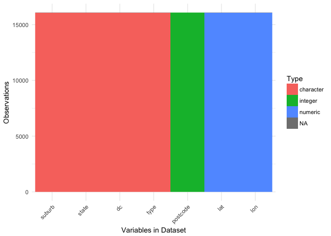
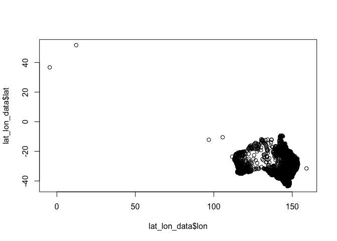
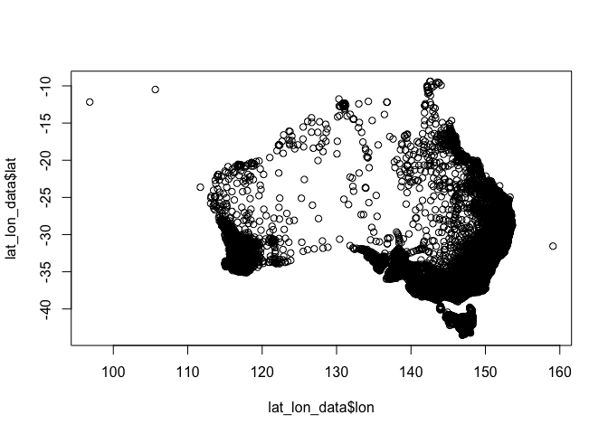

Create Australian\_Post\_Codes\_Lat\_Lon.Rda File
================

Gather Latitude and Longitude Data for mapping BOM Data
-------------------------------------------------------

The BOM xlm file does not contain any lat or lon information so we need to get that from elsewhere.

The file does not contain all sites, a few need to be added manually.

``` r
download.file("http://www.corra.com.au/downloads/Australian_Post_Codes_Lat_Lon.zip", 
              destfile = paste0(tempdir(), "post_codes.zip"))

lat_lon_data <- readr::read_csv(paste0(tempdir(), "post_codes.zip"))
```

    ## Parsed with column specification:
    ## cols(
    ##   postcode = col_integer(),
    ##   suburb = col_character(),
    ##   state = col_character(),
    ##   dc = col_character(),
    ##   type = col_character(),
    ##   lat = col_double(),
    ##   lon = col_double()
    ## )

``` r
lat_lon_data
```

    ## # A tibble: 16,080 × 7
    ##    postcode                         suburb state
    ##       <int>                          <chr> <chr>
    ## 1       200 AUSTRALIAN NATIONAL UNIVERSITY   ACT
    ## 2       221                         BARTON   ACT
    ## 3       800                         DARWIN    NT
    ## 4       801                         DARWIN    NT
    ## 5       804                          PARAP    NT
    ## 6       810                          ALAWA    NT
    ## 7       810                        BRINKIN    NT
    ## 8       810                      CASUARINA    NT
    ## 9       810                        JINGILI    NT
    ## 10      810                      LEE POINT    NT
    ## # ... with 16,070 more rows, and 4 more variables: dc <chr>, type <chr>,
    ## #   lat <dbl>, lon <dbl>

Plot the Data to Check Integrity
--------------------------------

Install the `visdat` package to check the data integrity of the file.

``` r
#install.packages("devtools", dep = TRUE)
devtools::install_github("njtierney/visdat", dep = TRUE)
```

    ## Skipping install of 'visdat' from a github remote, the SHA1 (c7ea5bb6) has not changed since last install.
    ##   Use `force = TRUE` to force installation

``` r
visdat::vis_dat(lat_lon_data)
```



Next map the points to check the integrity of the information in the data.

``` r
plot(lat_lon_data$lat ~ lat_lon_data$lon)
```



There are some suspect stations in the upper left.

``` r
subset(lat_lon_data, lat > 0)
```

    ## # A tibble: 2 × 7
    ##   postcode    suburb state          dc          type      lat       lon
    ##      <int>     <chr> <chr>       <chr>         <chr>    <dbl>     <dbl>
    ## 1     5238 WALL FLAT    SA      MANNUM Delivery Area 51.68144 12.305986
    ## 2     7254   RETREAT   TAS GEORGE TOWN Delivery Area 36.70818 -4.547691

Checking these in Google Earth shows one point in Germany and one in Spain. For now we'll remove them.

``` r
lat_lon_data <- lat_lon_data[lat_lon_data$lat < 0, ]
```

Check the map again to be sure that they were properly removed from the data.

``` r
plot(lat_lon_data$lat ~ lat_lon_data$lon)
```



Adding Missing Stations
-----------------------

There are some stations missing in Queensland that we can add to this data set. These station data come from cross checking the BOM XML file with the `lat_lon_data` data set.

``` r
Qld_stations = readr::read_csv("Qld_stations.csv")
```

    ## Parsed with column specification:
    ## cols(
    ##   postcode = col_integer(),
    ##   suburb = col_character(),
    ##   state = col_character(),
    ##   dc = col_character(),
    ##   type = col_character(),
    ##   lat = col_double(),
    ##   lon = col_double()
    ## )

``` r
Qld_stations
```

    ## # A tibble: 5 × 7
    ##   postcode            suburb state                 dc          type
    ##      <int>             <chr> <chr>              <chr>         <chr>
    ## 1     4008  BRISBANE AIRPORT   QLD CITY DC - BRISBANE Delivery Area
    ## 2     4217 GOLD COAST SEAWAY   QLD CITY DC - BRISBANE Delivery Area
    ## 3     4871    LOCKHART RIVER   QLD CITY DC - BRISBANE Delivery Area
    ## 4     4892       PALMERVILLE   QLD CITY DC - BRISBANE Delivery Area
    ## 5     4824         URANDANGI   QLD CITY DC - BRISBANE Delivery Area
    ## # ... with 2 more variables: lat <dbl>, lon <dbl>

Now add these stations to the larger data set.

``` r
lat_lon_data <- rbind(lat_lon_data, Qld_stations)
```

Save Data for Inclusion in Package
----------------------------------

``` r
devtools::use_data(lat_lon_data, compress = "xz", overwrite = TRUE)
```

    ## Saving lat_lon_data as lat_lon_data.rda to /Users/U8004755/Development/WINS/data

R System Information
--------------------

    ## R version 3.3.2 (2016-10-31)
    ## Platform: x86_64-apple-darwin15.6.0 (64-bit)
    ## Running under: OS X El Capitan 10.11.6
    ## 
    ## locale:
    ## [1] en_AU.UTF-8/en_AU.UTF-8/en_AU.UTF-8/C/en_AU.UTF-8/en_AU.UTF-8
    ## 
    ## attached base packages:
    ## [1] stats     graphics  grDevices utils     datasets  methods   base     
    ## 
    ## loaded via a namespace (and not attached):
    ##  [1] Rcpp_0.12.9       knitr_1.15.1      magrittr_1.5     
    ##  [4] devtools_1.12.0   munsell_0.4.3     colorspace_1.3-2 
    ##  [7] R6_2.2.0          plyr_1.8.4        stringr_1.1.0    
    ## [10] httr_1.2.1        dplyr_0.5.0       tools_3.3.2      
    ## [13] grid_3.3.2        gtable_0.2.0      DBI_0.5-1        
    ## [16] git2r_0.18.0      withr_1.0.2       htmltools_0.3.5  
    ## [19] yaml_2.1.14       lazyeval_0.2.0    assertthat_0.1   
    ## [22] rprojroot_1.2     digest_0.6.12     tibble_1.2       
    ## [25] purrr_0.2.2       readr_1.0.0       ggplot2_2.2.1    
    ## [28] tidyr_0.6.1       curl_2.3          memoise_1.0.0    
    ## [31] evaluate_0.10     rmarkdown_1.3     labeling_0.3     
    ## [34] stringi_1.1.2     scales_0.4.1      backports_1.0.5  
    ## [37] visdat_0.0.5.9000
